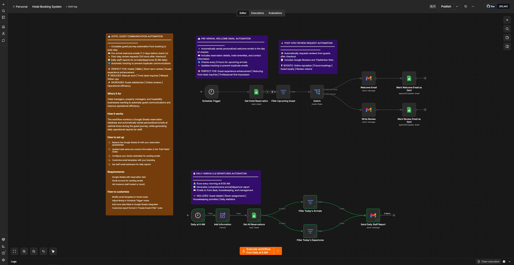

# Hotel Guest Communication & Operations Automation (n8n Workflow)

An end-to-end guest journey automation system built using **n8n**, designed for hotels and property managers to automate pre-arrival welcome emails, post-stay review requests, and daily operational staff reporting.

## 🚀 Project Overview
This workflow automates critical hospitality touchpoints:
1. **Pre-Arrival Welcome Automation:** Automatically sends personalized welcome details and hotel amenities 1–2 days before check-in.
2. **Post-Stay Review Request Automation:** Triggers review requests 24 hours after checkout, incorporating links to boost online reputation.
3. **Daily Staff Reports:** Generates and dispatches daily arrivals and departures schedules every morning at 6:00 AM to front desk and housekeeping teams.

## ⚙️ Workflow Architecture & Nodes
* **Schedule Trigger:** Runs periodic checks for upcoming arrivals or scheduled morning reports.
* **Get Hotel Reservation (Google Sheets):** Fetches guest data from a centralized database.
* **Filter Nodes:** Prevents duplicate communications and segments guests by status.
* **Switch Node:** Routes operational pathways.
* **Gmail Nodes:** Dispatches automated emails for welcome, reviews, and internal staff briefings.

## 🛠️ Tech Stack
* **n8n** (Workflow Orchestration)
* **Google Sheets API** (Reservation Database)
* **Gmail API** (Automated Guest Messaging & Staff Reports)
* **Webhooks & Schedule Triggers**

## 📸 Workflow Preview

